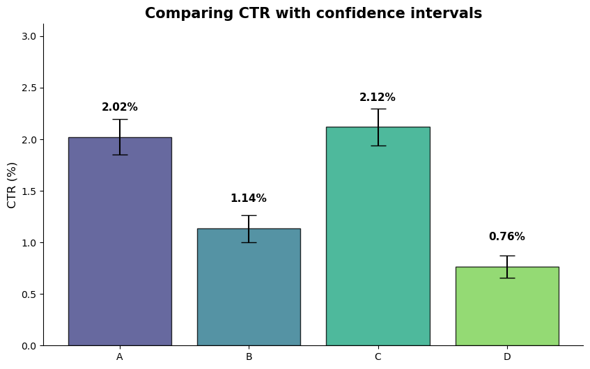
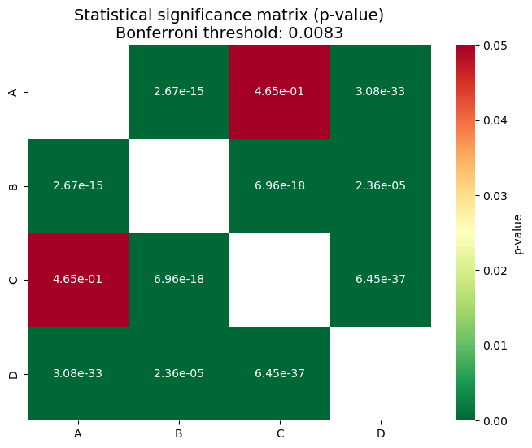

# A/B/n Testing: Optimizing Conversion Funnels via Button UX

## 📌 Project Overview
The objective of this project was to optimize the Click-Through Rate (CTR) of Eniac’s homepage primary banner. Following user feedback indicating that the original "SHOP NOW" text felt like "too immediate a commitment," I analyzed an **A/B/n test** (run from Nov 2 to Nov 16, 2021) comparing four variations of button color and text to identify the optimal balance between visual salience and messaging.

---

## 📊 Key Business & Statistical Insights

### 1. The Color Dominance Effect
Analysis confirms that visual features (Color) were a much stronger driver of engagement than CTA semantics (Text). 
* **White buttons** significantly outperformed red ones, achieving a CTR of **~2.0-2.1%**.
* **Red buttons** led to a sharp decline in performance, with CTR dropping as low as **~0.76%**.

  

<em>Figure 1: CTR with 95% Confidence Intervals</em>

### 2. Strategic "Post-Hoc" Significance
While the overall test showed a difference, I performed a **Post-hoc analysis with Bonferroni correction** ($p_{threshold} = 0.0083$) to isolate the winner. The matrix reveals that the difference between "SHOP NOW" (A) and "SEE DEALS" (C) is **statistically insignificant** ($p = 0.465$), meaning we cannot guarantee a lift by switching texts.

<table border="0">
  <tr>
    <td width="100%" valign="middle">
      
      
<em>Figure 2: Statistical Significance Matrix (p-values)</em>

    </td>
  </tr>
</table>

---

## 🛠️ Tech Stack & Methodology
* **Language:** Python (Pandas, NumPy)
* **Statistics:** Hypothesis Testing ($\chi^2$), Post-hoc Analysis (Bonferroni Correction), Confidence Intervals
* **Visualization:** Matplotlib, Seaborn
* **Domain:** E-commerce / Conversion Rate Optimization (CRO)

## 📂 Project Structure
* `abn-testing-ux-hypothesis.ipynb` — Full Python pipeline including data cleaning, Chi-square testing, and statistical visualization.
* `images/` — Directory containing key statistical plots used in this report.

## 💡 Final Conclusion & Recommendation
The test confirmed a significant advantage of white buttons over red ones. The difference between the "SHOP NOW" and "SEE DEALS" texts in the current data set did not reach statistical significance. 

**Given the low incoming traffic, continuing the test is not advisable. It is recommended to retain the current option A, as switching to option C does not guarantee measurable profit gains and requires implementation resources.**
